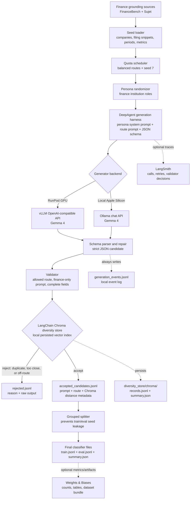

# Synthetic Data Gen

Generate finance-only router classification data with a vLLM or Ollama model backend, institution
personas, schema-constrained JSON output, embedding diversity filters, and local/LangSmith/W&B
observability.

This repo owns data generation only. The classifier repo consumes the generated JSONL files through
the `data-gen` Git submodule.

## Architecture

The generator builds a finance-only prompt dataset by grounding on public finance corpora, asking a
persona-scoped DeepAgent to produce one schema-constrained candidate at a time, then accepting only
the candidates that pass strict validation and local Chroma diversity checks.



Acceptance is intentionally conservative:

- The model backend only proposes candidates; it does not decide whether a row enters the dataset.
- The validator enforces the finance-router schema and allowed route labels.
- Chroma handles vector indexing and nearest-neighbor distance search on disk.
- The repo-owned policy decides whether Chroma's nearest same-route neighbor is too close, too far
  after the route has enough examples, or safe to accept.

## Output Schema

Each generated row is compatible with `finance-router-classifier`:

```json
{
  "id": "...",
  "text": "Can you pull Apple's fiscal 2023 revenue from this filing excerpt?",
  "route": "metric_extraction",
  "source": "synthetic:vllm:google/gemma-4-E4B-it",
  "company": "Apple Inc",
  "metadata": {}
}
```

Routes:

- `metric_extraction`
- `filing_summarization`
- `financial_qa`
- `financial_reasoning`
- `comparative_analysis`

## Project Layout

- `src/synthetic_data_gen/types/`: domain types, JSON payload types, records, and text helpers.
- `src/synthetic_data_gen/backends/`: clean vLLM and Ollama backend boundaries.
- `src/synthetic_data_gen/harnesses/`: DeepAgent generation harness and direct schema smoke harness.
- `src/synthetic_data_gen/models/`: typed request, diversity policy, and store records.
- `src/synthetic_data_gen/diversity/`: LangChain/Chroma local vector store and acceptance policy.
- `src/synthetic_data_gen/generation_schema.py`: JSON schema passed to the model server.
- `src/synthetic_data_gen/prompts.py`: baked generation prompt templates.
- `src/synthetic_data_gen/validation.py`: strict conversion from model JSON to classifier rows.
- `src/synthetic_data_gen/builder.py`: quota loop, embedding diversity gate, grouped split, artifacts.
- `src/synthetic_data_gen/observability.py`: local events plus optional W&B/LangSmith hooks.

## Setup

```bash
uv sync --python 3.12
```

## RunPod Setup

On a fresh RunPod container:

```bash
cd ~/synthetic-data-gen
bash scripts/runpod_setup.sh
```

The setup script installs system packages, uv, vLLM, persists cache directories, and runs `uv sync`.
If `/workspace` exists, it stores uv/Hugging Face/PyTorch caches there so the small root disk does
not fill up. Ollama is still available as an optional backend by running
`INSTALL_OLLAMA=1 bash scripts/runpod_setup.sh`.

Start vLLM in one terminal:

```bash
cd ~/synthetic-data-gen
bash scripts/start_vllm_gemma4.sh
```

The default served model is `google/gemma-4-E4B-it`, which is the larger E4B Gemma 4 model. If your
pod has an 80 GB GPU and you want to try a bigger model, run with
`MODEL_ID=google/gemma-4-26B-A4B-it bash scripts/start_vllm_gemma4.sh` and pass the same model name
to `--generator-model`.

## Local Apple Silicon Setup

For local MPS-backed generation, use Ollama. The generator calls Ollama through its native chat API
with the same JSON schema used for vLLM, and the backend name stays `ollama` so artifacts clearly
show which server produced the data.

```bash
ollama serve
ollama pull gemma4:e4b

uv run synthetic-data-gen build \
  --out data/smoke-ollama \
  --train-size 50 \
  --eval-size 25 \
  --generation-harness direct \
  --generator-backend ollama \
  --generator-model gemma4:e4b \
  --ollama-base-url http://localhost:11434 \
  --embedding-device mps
```

## Build 10k Dataset

```bash
uv run synthetic-data-gen build \
  --out data/synthetic-10k \
  --train-size 8000 \
  --eval-size 2000 \
  --generation-harness deepagent \
  --generator-backend vllm \
  --generator-model google/gemma-4-E4B-it \
  --vllm-base-url http://localhost:8000/v1 \
  --embedding-model BAAI/bge-small-en-v1.5 \
  --embedding-device auto \
  --wandb-project finance-router-data-gen \
  --langsmith-project finance-router-data-gen
```

`--embedding-device auto` prefers CUDA, then MPS, then CPU. On RunPod, use
`--embedding-device cuda` if you want the local embedding diversity checks to fail loudly unless
CUDA is visible to PyTorch. Generation acceleration is controlled by the model server. With vLLM on
RunPod, the OpenAI-compatible server should be running on GPU and listening at
`http://localhost:8000/v1`.

The build writes:

- `train.jsonl`
- `eval.jsonl`
- `summary.json`
- `rejected.jsonl`
- `accepted_candidates.jsonl`
- `generation_config.json`
- `generation_events.jsonl`
- `diversity_store/records.jsonl`
- `diversity_store/chroma/`
- `diversity_store/summary.json`

Generated data is ignored by git.

## Observability

Local observability is always on through `generation_events.jsonl`, `summary.json`,
`accepted_candidates.jsonl`, `rejected.jsonl`, and the local `diversity_store/`. Accepted and
rejected candidates are flushed as the build runs, so you can inspect progress before the final
train/eval split exists. The CLI also prints colored status logs for the generation harness,
generator backend, embedding device, W&B/LangSmith status, seed counts, and final artifact paths.

The diversity store uses LangChain's Chroma integration on disk. Chroma owns the vector indexing and
nearest-neighbor distance search; this repo only owns the typed accept/reject policy.

The default generation path is `--generation-harness deepagent`. It creates persona-scoped
DeepAgents, so the seeded persona randomizer changes the system prompt used to generate each
candidate. Use `--generation-harness direct` for quick smoke tests when you only want a raw schema
call to the backend.

External observability is opt-in:

- W&B logs generation counters, rejection counts, and the dataset artifact when `--wandb-project`
  is set.
- LangSmith tracing is enabled when `--langsmith-project` is set and your LangSmith environment is
  configured.

## Smoke Build

```bash
uv run synthetic-data-gen build \
  --train-size 50 \
  --eval-size 25 \
  --out data/smoke \
  --generation-harness deepagent \
  --generator-backend vllm \
  --generator-model google/gemma-4-E4B-it \
  --vllm-base-url http://localhost:8000/v1
```

## Use With Classifier

From `finance-router-classifier`:

```bash
uv run finance-router train \
  --device mps \
  --train data-gen/data/synthetic-10k/train.jsonl \
  --eval data-gen/data/synthetic-10k/eval.jsonl \
  --batch-size 4 \
  --max-length 768 \
  --epochs 3 \
  --out-dir models/finance-router-synthetic-10k \
  --wandb-project finance-router-classifier \
  --wandb-run-name synthetic-10k-gemma4-e4b
```
